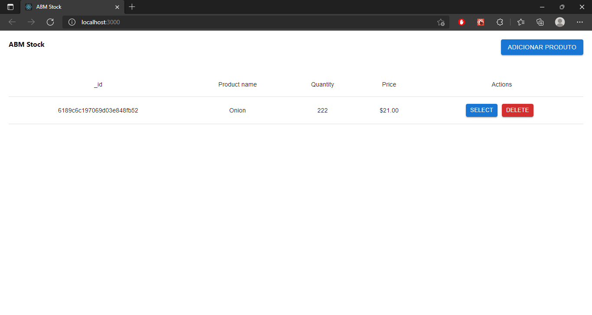
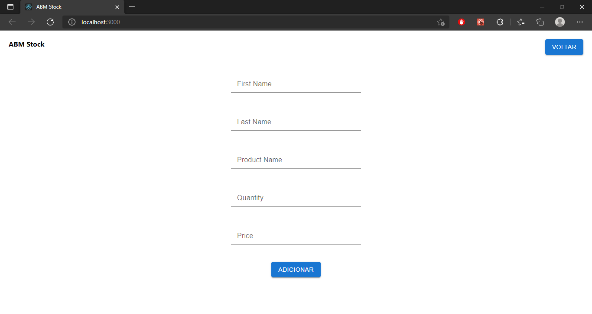

# Projeto ABM Stock
Esse projeto foi um desafio feito pela Lexart.  
O Botão de `SELECT` não está funcionando, ainda vou faze-lo funcionar.  

## Como rodar
- Clone o repositorio usando o comando `git clone`
- Navegue para a pasta onde clonou o projeto
- Execute `npm install` ou `yarn` para instalar todas as dependências.
- Instalado as depedências, execute `npm start` ou `yarn start` para rodar a aplicação, usando a url **localhost:3000/** (porta padrão **3000** do react).

### Tela Inicial

### Tela para adicionar produto

## Feebback
Deixe seu feeback, pontos de melhorias, algo que poderia ser feito de um jeito melhor, qualquer feedback é bem vindo :)
